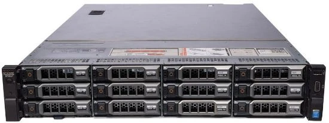

# PVE服务器指南

## 硬件开箱
### 简单介绍
最初只是有一点小小的服务器需求，~~~本来打算买个小主机的~~~，但转念一想买都买了不如整个更耐折腾的......最终入手了一台戴尔 Pow­erEdge R730XD 机柜式服务器......



整体长这样，配置如下：
- E5 2680v4 x2
- 16g ddr4 x4
- H730p mini 阵列卡 x1
- 750W 电源 x1
- 千兆网卡 x4

扩展性如下：
- 前面板可以扩展12个3.5寸 SATA/SAS/U.2 硬盘，有一个usb2.0和一个vga接口
- 内置一个usb3.0，可以额外扩展4个硬盘，还有多个pcie槽位
- 后面板可以安装两个2.5寸 SATA/SAS 硬盘，有两个usb3.0

我又额外安装了：
- 1条nvme固态(通过pcie转接的)
- 1条傲腾16g(通过pcie转接的)
- 1个SATA固态
- 2个SAS机械
> 需要注意的是bios不支持使用nvme的硬盘进行系统引导

### 固件更新
- [BIOS](https://www.dell.com/support/home/zh-cn/drivers/driversdetails?driverid=kgtj5) -- 推荐安装一个Windows再使用EXE安装包更新，iDRAC比较麻烦
- [iDRAC](https://www.dell.com/support/home/zh-cn/drivers/driversdetails?driverid=vwf72&oscode=w12r2&productcode=poweredge-r730xd) -- 推荐安装一个Windows再使用EXE安装包更新，iDRAC比较麻烦
## PVE安装
### BIOS设置
- 将阵列卡设置HBA直通模式
- 将pcie转4个m.2拆分卡所插入的slot槽设置为x4x4x4x4
- 开启网卡的wake on lan
### 安装
镜像地址：
https://www.proxmox.com/downloads

1. 使用rufus或者ventoy制作启动盘
2. 选择SATA SSD安装，使用XFS文件系统
3. 选择对应的网卡，Hostname前面是主机名，后面是域名
4. 安装完成重启，登录对应的访问地址

### 合并硬盘分区

1. 删除local-lvm
```bash
lvremove pve/data
```

2. 扩容local
```bash
lvextend -l +100%FREE -r pve/root
```
> 然后数据中心进行图形界面的local-lvm删除和local编辑。

3. 确认网络是否正常
```bash
ping www.baidu.com
```
> 如果ping不通，修改网关和dns。

4. 更换软件源

清华镜像站 https://mirrors.tuna.tsinghua.edu.cn/help/debian

北大镜像站 https://mirrors.pku.edu.cn/Help/Debian
```bash
nano /etc/apt/sources.list
```
添加网页上的内容，保存退出。

建议全部修改成清华源：
```txt
deb https://mirrors.tuna.tsinghua.edu.cn/debian-security bookworm-security main contrib non-free non-free-firmware
```

5. 修改pve源

添加清华源 https://mirrors.tuna.tsinghua.edu.cn/help/proxmox

重邮 https://mirrors.cqupt.edu.cn/
```bash
nano /etc/apt/sources.list.d/pve-no-subscription.list
```
加入内容   
```txt
deb https://mirrors.tuna.tsinghua.edu.cn/proxmox/debian/pve bookworm pve-no-subscription
```
6. 去掉企业源
```bash
nano /etc/apt/sources.list.d/pve-enterprise.list
```
前面加入#

7. 去掉ceph源（有需要的可以之后自行修改）
```bash
nano /etc/apt/sources.list.d/ceph.list
```
前面加入#

8. PVE更新--存储库里面添加pve-no-subscription

9. 去掉登录弹窗：
```bash
sed -i.backup -z "s/res === null || res === undefined || \!res || res\n\t\t\t.data.status.toLowerCase() \!== 'active'/false/g" /usr/share/javascript/proxmox-widget-toolkit/proxmoxlib.js && systemctl restart pveproxy.service
```

10. 更新软件源，升级软件
```bash
apt update
apt upgrade -y
```

11. 开启IPV6（可选）
```bash
nano /etc/sysctl.conf
```
添加如下内容：
```txt
net.ipv6.conf.all.accept_ra=2
net.ipv6.conf.default.accept_ra=2
net.ipv6.conf.vmbr0.accept_ra=2
net.ipv6.conf.all.autoconf=1
net.ipv6.conf.default.autoconf=1
net.ipv6.conf.vmbr0.autoconf=1
```

12. 重启系统：reboot

## fnOS安装
> 需要注意的是前置和后置硬盘使用同一个pcie控制器，直通时要注意
## iStoreOS安装

## Linux安装

## Windows安装

## MacOS安装
