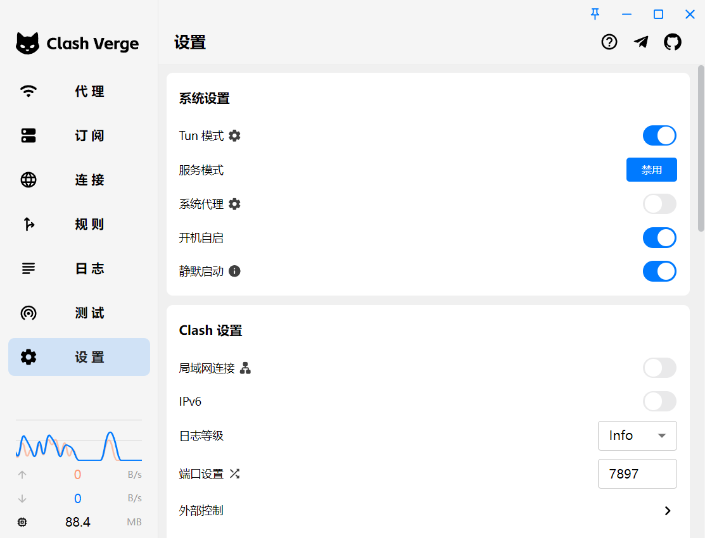

# Windows环境搭建

## Chrome
> https://www.google.cn/chrome/index.html

## Winget
> https://learn.microsoft.com/zh-cn/windows/package-manager/winget/#install-winget

- 更新所有软件包
```
winget upgrade --all
```
- 列举所有软件包
```
winget list
```
- 禁止更新某个软件包
```
winget pin add --id=LLVM.LLVM
```

## 代理工具 Clash Verge
```
winget install ClashVergeRev.ClashVergeRev -i -s winget
```
Trojan订阅在 Actions secrets and variables 的 Repository variables 里



UWP
- Microsoft Store
- 工作或学校帐户
- OneDrive

## MinGW
可直接使用Qt构建的MinGW
> https://wiki.qt.io/MinGW
Qt的版本可能较旧，这里的新一点
> https://winlibs.com
==不要下载带LLVM的MinGW，因为里面的Clangd解析不了MSVC后端==

## LLVM
```
winget install LLVM.LLVM -i -s winget
```
> 在 VSCode 使用 Clangd 时，一定要注意：
> 官网的 LLVM 采用 MSVC 作为后端
> 如果从 https://winlibs.com 下载，则使用MinGW作为后端

## 字体
> https://www.nerdfonts.com/font-downloads

安装两个即可


## powershell
1. 安装[powershell7](https://learn.microsoft.com/zh-cn/powershell/scripting/install/installing-powershell-on-windows?view=powershell-7.4)
```
winget install --id Microsoft.Powershell --source winget
```
2. windows terminal 设置 powershell 为默认启动项
3. 安装[oh-my-posh](https://ohmyposh.dev/docs/installation/windows)
```
winget install JanDeDobbeleer.OhMyPosh -s winget
```
4. 把 my_theme.omp.json 放到 oh-my-posh 的主题目录下
> C:\Users\horel\AppData\Local\Programs\oh-my-posh\themes

5. 安装powershell目录跳转插件 [z](https://www.powershellgallery.com/packages/z/1.1.13)
```
Install-Module -Name z
```
1. 设置 oh-my-posh 的启动
```
notepad $PROFILE
```
```
oh-my-posh init pwsh --config 'C:\Users\horel\AppData\Local\Programs\oh-my-posh\themes\my_theme.omp.json' | Invoke-Expression
Set-PSReadlineKeyHandler -Key Tab -Function MenuComplete
Set-PSReadlineKeyHandler -Key "Ctrl+d" -Function ViExit
Import-Module z
```
## Terminal
> https://github.com/microsoft/terminal

设置存放在截图中

## VSCode
> https://code.visualstudio.com/
- 安装时勾选注册到打开目录上下文

- 导出插件
```
code --list-extensions > code_extensions.txt
```
- 导入插件
```
cat code_extensions.txt |% { code --install-extension $_}
```
- 设置
```
"workbench.colorTheme": "One Dark Pro",
"editor.fontSize": 18,
"editor.fontFamily": "'JetBrainsMono Nerd Font', Consolas, 'Courier New', monospace",
"C_Cpp.intelliSenseUpdateDelay": 500,
"xmake.compileCommandsDirectory": "${workspaceRoot}/build",
"C_Cpp.intelliSenseEngine": "disabled",
"terminal.integrated.defaultProfile.windows": "PowerShell",
"xmake.debugConfigType": "codelldb",
"liveServer.settings.donotShowInfoMsg": true,
"[vue]": {
    "editor.defaultFormatter": "Vue.volar"
},
"vue.autoInsert.dotValue": true
```
- 快捷键设置（右键添加键绑定）
```
selectNextSuggestion : Tab
selectPrevSuggestion : Shift + Tab
editor.action.formatDocument : ctrl+k ctrl+f
editor.action.formatDocument.none : ctrl+k ctrl+f
```

## UE5
> https://store.epicgames.com/zh-CN/

C++开发建议安装：引擎源代码+~~输入调试用符号~~
其余目标平台不需要安装

## VS2022
> https://visualstudio.microsoft.com/zh-hans/

> 使用C++的桌面开发，UE5需要安装 
> - .NET 
> - C++桌面 
> - C++游戏

> 扩展 : 
> - ReSharper 
> - One Dark Pro

Ninja
```
C:\Program Files\Microsoft Visual Studio\2022\Community\Common7\IDE\CommonExtensions\Microsoft\CMake\Ninja
```
CMake
```
C:\Program Files\Microsoft Visual Studio\2022\Community\Common7\IDE\CommonExtensions\Microsoft\CMake\CMake\bin
```

## 有用的小工具
- snipaste
> 微软商店下载

- utools (手机号登陆)
```
winget install Yuanli.uTools -i -s winget
```

- xmake
```
winget install Xmake-io.Xmake -i -s winget
```

- Bandizip
```
winget install Bandisoft.Bandizip --version 6.29 -i -s winget
```

- Git
```
winget install Git.Git -i -s winget
```
```
git config --global user.name "username"
git config --global user.email useremail@gmail.com
```

- Python
```
winget install Python.Python.3.13 -i -s winget
```
- DiskGenius
> https://www.diskgenius.cn/download.php

- ContextMenuManager
> https://github.com/BluePointLilac/ContextMenuManager/releases

- Office Tool Plus
> https://otp.landian.vip/zh-cn/download.html

## Office 破解
> https://otp.landian.vip/zh-cn/download.html

先部署一个64位的Office，365企业应用版
```
deploy /add O365ProPlusRetail_zh-cn /O365ProPlusRetail.exclapps Access,Bing,Groove,Lync,OneDrive,OneNote,Outlook,Publisher,Teams /channel Current /dlfirst
```

自动激活，按下快捷键 Ctrl + Shift + P，打开命令框
```
ospp /inslicid MondoVolume /sethst:kms.loli.beer /setprt:1688 /act
```

## 选做
### 驱动
==Windows会自动安装驱动，没问题就不要安装了==
技嘉驱动
> https://www.gigabyte.com/tw/Laptop/AORUS-15--RTX-20-Series/support#dl

网卡驱动
> https://www.intel.cn/content/www/cn/zh/download/19779/intel-killer-performance-suite.html

蓝牙驱动
> https://www.intel.cn/content/www/cn/zh/download/18649/intel-wireless-bluetooth-for-windows-10-and-windows-11.html

### Rider (已不推荐使用)
> https://www.jetbrains.com/rider/

破解
> https://3.jetbra.in/
> 下载 jetbra.zip
> 放在专门的环境目录下，系统环境变量会保存目录
> 运行 jetbra\scripts\xxx
> 复制网站上的激活码进行激活

设置可直接导入

### Rider 破解
#### 使用插件无限试用（适用于比较老的版本）
> 此方法仅仅试用于 2021.2.2 （包含 2021.2.2 版本） 以下版本

https://youwu.today/blog/jetbrains-evaluate-reset/
https://zhile.io/2020/11/18/jetbrains-eval-reset-deprecated.html
https://www.cnblogs.com/iqiuq/p/17227406.html
- 在Settings/Preferences... -> Plugins 内手动添加第三方插件仓库地址：https://plugins.zhile.io
- 搜索：IDE Eval Reset插件进行安装。如果搜索不到请注意是否做好了上一步？网络是否通畅？
#### 激活脚本 + 激活码
https://www.exception.site/essay/idea-reset-eval
https://www.bilibili.com/video/BV1fp4y1o7MM/?spm_id_from=333.999.0.0
- 下载 jetbra.zip （https://jetbra.in/s）
- 双击执行 install-current-user.vbs 破解脚本
- 复制 Rider 的激活码
- 粘贴激活码进去