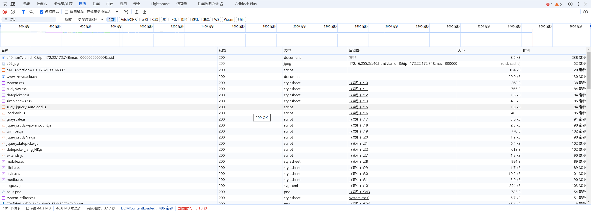
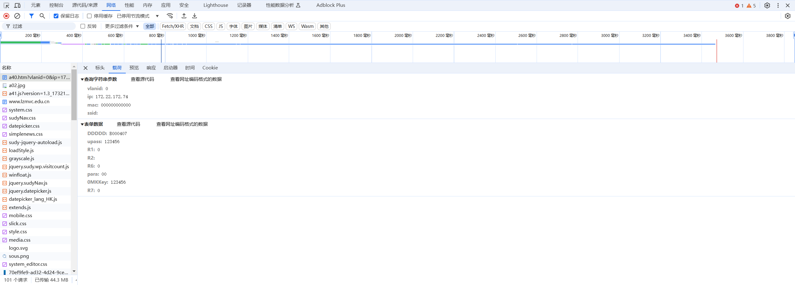
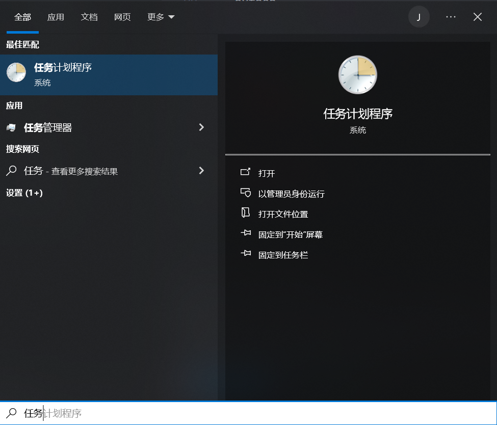
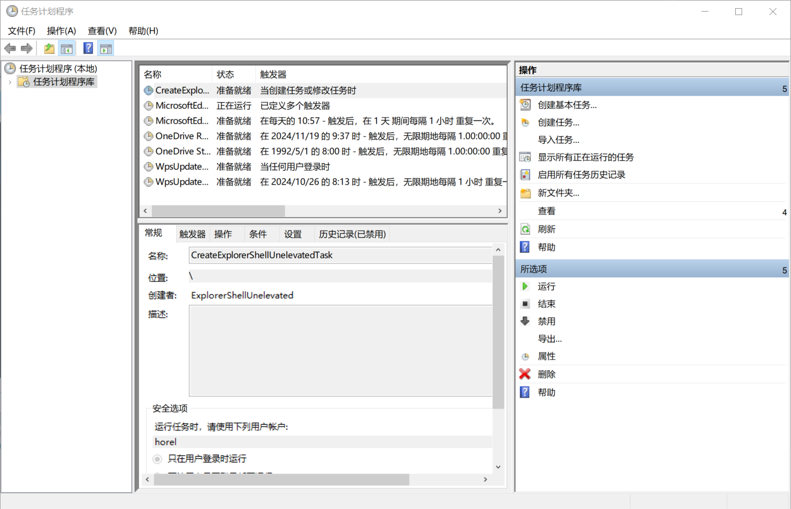
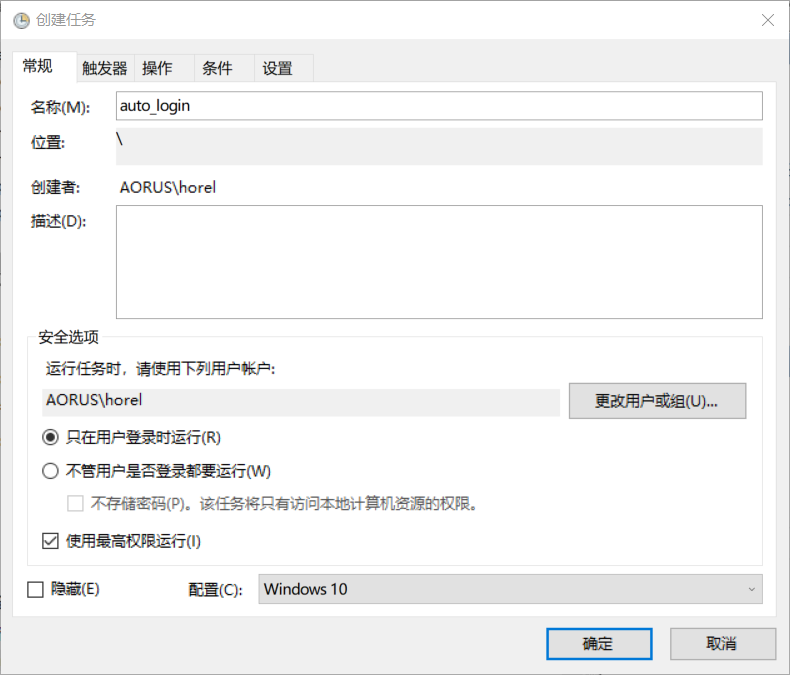
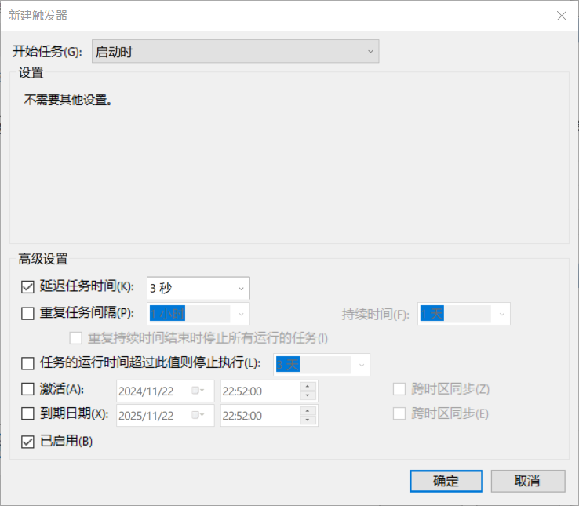
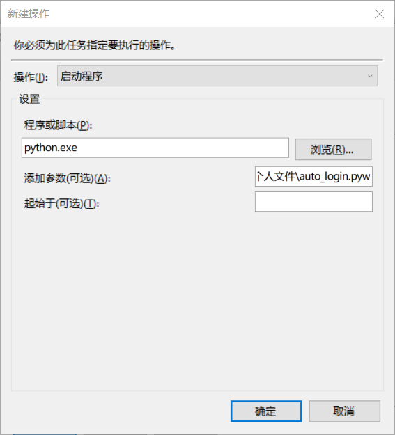
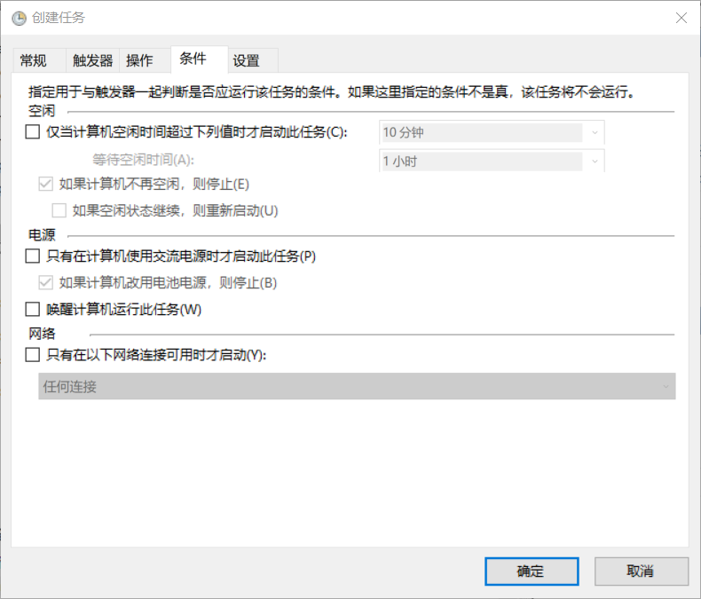

# 校园网自动登录脚本实现
> 因为每次开机登录校园网都会花费两秒钟的时间，并且鼠标耐久度-2，因此诞生了写一个python脚本实现自动登录的想法
## 分析
- 查看校园网登录页面，发现校园使用 post 方法
- 右键打开检查(F12)，切换到网络页面，点击保留日志

- 点击登录按钮，查看保留的日志
- 点击第一条网络请求，查看载荷

- 将表单数据对应的内容作为参数传给post

## 代码编写
> 附上代码如下: 
```python
import os
import requests

# 配置登录信息
LOGIN_URL = "http://172.16.255.2/a40.htm?vlanid=0&ip=172.22.184.93&mac=000000000000&ssid="
USERNAME = os.getenv("CAMPUS_NET_USERNAME", "填写登录账户")  # 请自行修改 "填写登录账户" 为自己的校园网账户
PASSWORD = os.getenv("CAMPUS_NET_PASSWORD", "填写登录密码")  # 请自行修改 "填写登录账户" 为自己的校园网密码

# 登录函数
def login_to_campus_net():
    if not USERNAME or not PASSWORD:
        print("登录失败, 请设置环境变量")
        return False

    payload = {
        "DDDDD": USERNAME,
        "upass": PASSWORD,
        "R1": "0",
        "R2": "",
        "R6": "0",
        "para": "00",
        "0MKKey": "123456",
        "R7": "0"
    }

    try:
        response = requests.post(url=LOGIN_URL, data=payload, timeout=10)

        # 检查登录结果
        if response.status_code == 200 and "success" in response.text:
            print("登录成功")
            return True
        else:
            print("登录失败")
            return False

    except requests.exceptions.Timeout:
        print("登录失败, 连接超时，请检查网络状态")
        return False
    except requests.exceptions.ConnectionError:
        print("登录失败, 无法连接到服务器，请检查登录地址")
        return False
    except requests.exceptions.RequestException as e:
        print("登录失败, 网络请求出错: {e}")
        return False

# 主程序
if __name__ == "__main__":
    success = login_to_campus_net()
    if success:
        print("校园网登录成功！")
    else:
        print("校园网登录失败！")
    os._exit(0)
```

## 脚本通知(选做)
可以使用 win10toast 这个库，改进脚本运行的提示内容，将脚本当中的print全部替换为windows自带的消息通知
```python
from win10toast import ToastNotifier

ToastNotifier().show_toast(
    title = "登录成功",
    msg = "校园网状态",
    duration = 5,
    threaded = False
)
```

## 设置脚本开机自启
- 搜索任务计划程序


- 创建任务


- 给予权限，win10运行


- 触发器设置启动时，延迟3秒


- 设置 python 启动该脚本，参数填写 auto_login.pyw 脚本路径


- 取消电源设置

